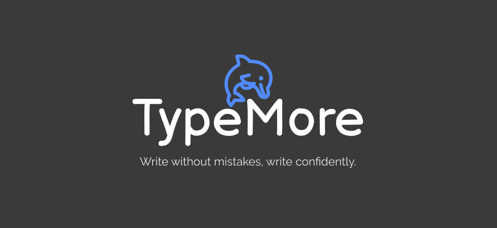

# TypeMore

TypeMore is a web site about typing test. For improve your typing scills, and have fun time with your frends. 


## Features
- Themes


## Tech Stack

**Client:** Vue, VueRouter, SCSS, TypeScript, Vee-validate, Vite

**Server:** Golang, GORM, Gin

## Base colors

| Color             | Hex                                                                |
| ----------------- | ------------------------------------------------------------------ |
| Main color |  #528bff |
| Background color |  #121212 |
| Sub alt color |  #1c1c1c |
| Sub color |  #3a3a3a |
| Text color |  #eeeeee |
| Error color |  #da3333 |
| Extra error color |  #791717 |

## Run Locally

Clone the project

```bash
  git clone https://github.com/Eg0r0k/TypeMore_front.git
```

Go to the project directory

```bash
  cd project
```

Install dependencies

```bash
  npm i
```

Start the server

```bash
  npm run dev
```

