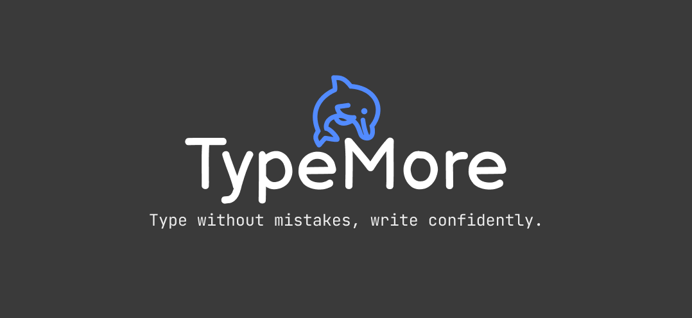

# TypeMore

TypeMore is a modern web application for testing and improving typing skills. The project offers an interactive interface for touch typing practice, competing with friends, and tracking progress.

## Key Features

- **Multiple Test Modes**:
  - Time Mode
  - Word Count Mode
  - Free Mode
  - Custom Text Mode

- **Personalization**:
  - Customizable Themes
  - Interface Language Selection
  - Font Size Adjustment
  - Sound Effects

- **Statistics and Analytics**:
  - Typing Speed (WPM)
  - Accuracy
  - Result History
  - Detailed Error Statistics


## Tech Stack

### Frontend
- **Framework**: Vue 3
- **State Management**: Pinia
- **Routing**: Vue Router
- **Styling**: SCSS
- **Language**: TypeScript
- **Build Tool**: Vite
- **Form Validation**: Vee-validate

### Backend
- **Language**: Golang

## Base Colors

| Name | Hex | Preview |
|----------|-----|--------------|
| Main color | #528bff |  |
| Background color | #121212 |  |
| Sub alt color | #1c1c1c |  |
| Sub color | #3a3a3a |  |
| Text color | #eeeeee |  |
| Error color | #da3333 |  |
| Extra error color | #791717 |  |

## Local Development

### Prerequisites

- Node.js (version 16 or higher)
- npm or yarn
- Git

### Installation

1. Clone the repository:
```bash
git clone https://github.com/Eg0r0k/TypeMore_front.git
```

2. Navigate to the project directory:
```bash
cd TypeMore_front
```

3. Install dependencies:
```bash
npm install
```

4. Start the development server:
```bash
npm run dev
```

## Project Structure

```
src/
├── app/            # Application configuration
├── entities/       # Business entities
├── features/       # Feature modules
├── pages/          # Application pages
├── shared/         # Shared components and utilities
└── widgets/        # Composite components
```

## Contributing

We welcome contributions to the project! If you'd like to help:

1. Fork the repository
2. Create a branch for your changes
3. Make your changes
4. Submit a Pull Request

## Development Roadmap

- [ ] Add new testing modes
- [ ] Improve speed calculation algorithm
- [ ] Social media integration
- [x] Mobile version
- [ ] Offline mode

## License

This project is licensed under the MIT License - see the [LICENSE](LICENSE) file for details.


## Authors

- [@Eg0r0k](https://github.com/Eg0r0k) - Development and Design

---

Made with ❤️
