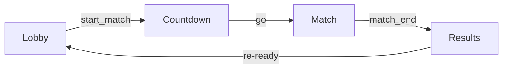

# TypeMore Match & Mods Model

Status: **lobby/room model and the event relay implemented (relay, finish,
match end, disconnect/resume, capture persistence); scoring lands with the
replay worker.**

This document is the source of truth for the **mods split** and how mods relate
to the **match score**. The wire shapes referenced here (`settings`, `freemods`,
`room_state`, `countdown`, …) are defined in [`PROTOCOL.md`](./PROTOCOL.md); this
file explains the *model* behind them so the frontend and server agree on what
each mod means and what it costs.

---

## 1. Match lifecycle

- **Lobby.** Seats join, pick freemods, ready up; the host edits settings. All
  configuration happens here and only here (settings/freemods changes are
  rejected once a match is running).
- **Countdown.** `start_match` (host-only, gated — see §4) **freezes** the room
  settings and every seat's freemods, mints a fresh `matchId` and
  server-generated `seed`, and broadcasts a `countdown` with the shared
  `goAtServerMs`.
- **Match.** Each client streams `event_batch` frames (tagged with the
  `matchId`); the server validates only the envelope, **stamps** each with its
  receive time, appends it to that player's authoritative capture, and relays it
  as `peer_batch` to the other seats (lossless, per-player order preserved). A
  mid-match drop keeps the seat for a 15 s grace window, buffering the peer
  backlog; a `hello` with the seat's `resumeToken` replays the backlog and
  resumes, else the seat is `dnf`'d on expiry (see PROTOCOL.md §6).
- **Results.** A client sends `finish` when done; a finished player then
  **waits** while the others race. The match ends once every seat is
  finished/dnf/left, at the hard deadline (unfinished ⇒ `dnf`), or when the
  words-mode finish window closes. **AFK rules** (server-owned, `protocol.go`):
  a racing seat silent for **15 000 ms** (TRAILING, every mode) or — words mode
  only, after a **10 000 ms** warmup — idle for **≥ 0.6** of the GO-anchored
  bucket window (SHARE) is `dnf`'d by the sweep, and the **first** finish opens
  a **120 s** window that `dnf`'s the stragglers at close. The end is announced
  by a single `match_end` frame
  carrying the frozen roster's statuses — clients enter results only on
  `match_end` (a graced seat receives it via its backlog on resume, see
  PROTOCOL.md §4/§6). At end the server persists the authoritative capture —
  the match header plus, per player, the gzip'd stamped batch stream
  (`matches` / `match_runs`, no validation yet) — then resets ready flags. A
  **rematch** re-readies and gets a new `seed` and `matchId`.

### AFK: the client kick is a courtesy, the server sweep is the authority

The client kicks its own idle seat (`judgeIdle`, session store) before the
server would: `finish{forfeit:true}` — a frame the wire already has — plus the
eliminated screen, so an honest player leaves by an explained rule instead of
dying to the sweep. A modified client that ignores the kick gains nothing: it
sits out to the server's sweep and is `dnf`'d there — no honesty hole, the
rule only improves the exit for honest players. That courtesy carries an
obligation — **every client number sits strictly inside its server
counterpart**, checked by `src/__tests__/match/afk-kick.test.ts`:

| Rule | Client (courtesy) | Server (authority, `protocol.go`) |
|---|---|---|
| Continuous silence (every mode) | streak **12 000 ms** | TRAILING **15 000 ms** |
| Idle share of the GO-anchored window (words) | **≥ 0.55** | **≥ 0.6** |
| Share warmup | **8 000 ms** | **10 000 ms** |

The client needs BOTH rules because a streak alone cannot dominate a share
rule (scattered sub-streak idling still accumulates share). The in-match meter
(`afkProgress`) is the max of the two progresses and reaches 100% exactly at
the kick; it is labelled **idle**, never "afk" — the results screen's
`afkShare` is a different, post-hoc judging metric, and one word on two
numbers would read as a bug.

---

## 2. The three kinds of mods

Mods are split into three tiers by **who controls them** and **whether they can
be proven from the event log**. This split drives both the wire format and the
score.

### 2.1 Room settings — host-controlled, shared, text-affecting

Carried in `settings` (host-only `settings_update`, between matches). Every
field affects the generated text or the match rules and is **identical for all
players** — everyone types the same text.

- `name`, `visibility`, `mode`, `durationMs` | `wordCount`, `lang`, `dictHash`
- `textMods`: `{ punctuation, numbers, randomCase, reverse }` — **text-generation
  mods**. Because they change the text, they **MUST be shared**: the whole point
  of a race is that everyone gets the same map.
- `textSource`: the discriminated text origin. **v0 is `{ kind: "seeded" }`
  only.** The quote phase adds `{ kind: "quote", quoteId }` additively.

The generation **seed** is **not** a setting. It is server-generated and appears
only in `countdown`. A client cannot pick it: a pre-known seed would be a
pre-practiced map, which is unfair. (See PROTOCOL.md §5 for the rationale.)

### 2.2 Freemods — per-player, log-provable, **scored**

Carried per seat in `freemods` (any seat, `set_freemods`, between matches).
Chosen individually and **verifiable from the event log**, so they **count
toward the match score**.

- `difficulty`: `normal` | `expert` | `master`
- `minWpm`: `0` | `60` | `80` | `100`
- `nospace`: boolean

Freemods are broadcast in `room_state` (so peers see each other's picks) and
**frozen** into `countdown` at `start_match`. A `set_freemods` arriving during a
match is rejected — the match is scored against exactly the frozen snapshot.

### 2.3 Personal visual mods — client-local, **never scored**

`blind`, `fading`, `flashlight`. These are **client-local only**:

- they **never** travel on the wire,
- they **never** appear in `room_state` or `countdown`,
- they **never** affect the match score.

They are a personal challenge/handicap the player imposes on their own screen;
the server has no way to prove them and does not try.

---

## 3. The scoring rule

> **Only log-provable mods multiply the match score.**

Concretely: the **freemods** (§2.2) are the score multipliers, because they are
provable from the immutable event log. Room settings (§2.1) define the shared
map (they are the same for everyone, so they are not a per-player multiplier).
Personal visual mods (§2.3) are invisible to the server and contribute nothing to
the score.

This is why the split matters: it keeps the leaderboard honest. Anything that
multiplies a score must be reconstructible and checkable from what the client
actually sent.

---

## 4. `start_match` gating

`start_match` is host-only and valid **iff**:

1. the room has **at least two seats**, and
2. **every non-host seat is `ready`**.

Otherwise it is rejected with `not_ready` (or `forbidden` for a non-host caller,
or when a match is already running). The host itself does not need to be ready.
On success the freeze happens and a `countdown` is emitted to every seat.

---

## 5. Freeze semantics

At the instant `start_match` succeeds, the server snapshots:

- the room `settings` (including `textMods` and `textSource`), and
- each seat's `freemods`,

and stamps a fresh server-generated `seed`. That snapshot is the `countdown`
payload and is the **only** configuration the match uses. Later
`settings_update` / `set_freemods` frames are rejected until the match ends, so
there is no way to change the map or your multipliers after "go".

---

## 6. Persistence (the authoritative capture)

At match end the server writes the match in one transaction:

- **`matches`** — the header: `id` (the wire `matchId`), `room_code`, `name`,
  the frozen `settings` (incl. `textSource`) and per-player `freemods` snapshot
  as jsonb, `seed`, `dict_hash`, `lang`, `go_at`, `ended_at`.
- **`match_runs`** — one row per participant: `player_id`, `nick`, nullable
  `user_id` (the account, NULL for a guest), that player's `freemods`, the
  **gzip'd capture** (`log`: the ordered `{batchSeq, recvServerMs, events}`
  stream), `batch_count`, and `final_status` (`finished` | `dnf` | `left`).

This capture is the **authoritative input** for the future replay worker, which
will recompute metrics and the score from the log (applying the freemod
multipliers of §3). Relay v0 lands the capture only — **no validation now**.
