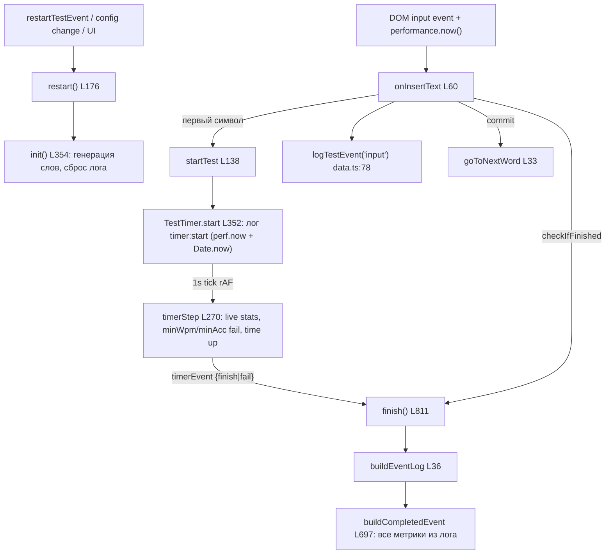
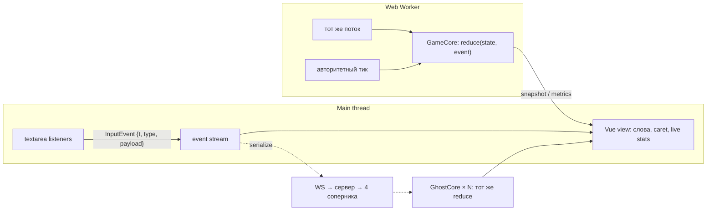

# Ревью monkeytype (master, июль 2026) для проектирования нашего ядра

Репозиторий склонирован в `F:\monkeytype` (shallow clone). Все пути ниже — относительно `F:/monkeytype/frontend/src/ts/`.

**Важный контекст:** свежий master сильно отличается от «классического» monkeytype. Фронтенд отрефакторен на Solid.js + сигналы, а главное — **ядро переведено на event log (event sourcing)**: старые `test-input.ts` / input-history удалены, весь ввод логируется как сериализуемый поток событий с таймстампами, и все метрики считаются чистыми функциями от этого лога. Таймер тоже переписан: вместо self-correcting `setTimeout` — animejs `createTimer` (rAF) с компенсацией дрифта (старый setTimeout-цикл оставлен закомментированным как `_startOld`, `test/test-timer.ts:375-416`). Это напрямую меняет выводы: значительная часть того, что мы хотели спроектировать сами (ввод как поток событий), у них уже сделана — и её стоит изучить как референс.

---

## 1. Карта релевантных модулей

### Ядро / состояние
| Путь | Ответственность |
|---|---|
| `test/test-logic.ts` (1376 строк) | Оркестратор lifecycle: `startTest` (L138), `restart` (L176), `init` (L354, генерация слов), `addWord` (L571), `buildCompletedEvent` (L697, весь расчёт результата), `finish` (L811), `fail` (L1228), `saveResult` (L1089). Смешивает логику, UI-анимации, сохранение, funbox. |
| `states/test.ts` | Solid-сигналы: `isTestActive`, `getActiveWordIndex` (+inc/dec/reset), `isTestRestarting`, `currentLiveStats` (store для live WPM/acc/raw), `getLastEventLog`, фокус-состояние. |
| `test/test-words.ts` | Модель целевых слов: `class Words`, элементы `{text, textWithCommit, commit, display, sectionIndex}`. Чистые данные без DOM. |

### Event log (сердце системы)
| Путь | Ответственность |
|---|---|
| `test/events/types.ts` | Схема `EventLog` v1: `TestEvent` (keydown/keyup/input/timer/composition), `InputEventData` `{data, correct, charIndex, wordIndex, inputValue, commitsWord…}`, `EventLogContext` (`targetWords`, mode, bailedOut). Фактически готовый wire-format. |
| `test/events/data.ts` | Хранилище: 5 модульных массивов событий; `logTestEvent` (L78, `roundTo2(performance.now())`), `buildEventLog` (L36), `getAllTestEvents` (L267, merge+sort, нормализация `testMs = ms − startEventMs`), `getCurrentInput` (L204 — текущий ввод деривируется из последнего события, не из DOM), `forceReleaseAllKeys` (L380, синтетические keyup), `cleanupData` (L229). |
| `test/events/stats.ts` | **Все метрики — чистые функции от EventLog**: `getChars` (L475), `getAccuracy` (L550), `getBurstHistory` (L264), `getWpmHistory` (L674), `getKeypressSpacing` (L586), `getKeypressDurations` (L842), `getAfkDuration` (L822), `getMissedWords` (L874), `getInputHistory` (L519), `getTimerBoundaries` (L52, идеальная секундная сетка от wall-clock). |
| `test/events/helpers.ts` | `applyInputEvent` (L94) — чистый редьюсер: события → строка ввода (основа реплея); `findInputValueMismatches` (L160) — самодиагностика расхождений деривации и DOM-снапшотов. |
| `test/events/live-cache.ts` | Инкрементальные счётчики для live-UI (accuracy, timerStartMs), чтобы не сканировать лог каждый кадр. Комментарий в файле: *«For replay, derive from the event log directly»*. |

### Ввод
| Путь | Ответственность |
|---|---|
| `input/input-element.ts` | Обёртка скрытой `<textarea id="wordsInput">`. Трюк: value хранится как `` ` ${value}` `` — ведущий sentinel-пробел, чтобы backspace на пустом слове порождал input-событие (детект перехода к предыдущему слову). |
| `input/listeners/{key,input,composition,misc}.ts` | Регистрация DOM-слушателей: keydown/keyup, beforeinput/input, compositionstart/update/end, selectionchange (принудительный каретка-в-конец). Один `performance.now()` на входе события (`input.ts:104`). |
| `input/handlers/keydown.ts` | Лог keydown-метрик (L123-125), эмуляция раскладки (`layout-emulator`), funbox, Tab/Enter/bailout. |
| `input/handlers/before-insert-text.ts` | Валидация ДО изменения DOM (вернул true → preventDefault): лимит длины слова (+20), блокировки, **замер геометрии слова для переноса строки (L110) — reflow на каждый символ**. |
| `input/handlers/insert-text.ts` | Ядро печати: `onInsertText` (L60) — нормализация → `isCharCorrect` → `logTestEvent('input')` (строго до навигации) → UI → `goToNextWord` → fail/finish. `emulateInsertText` (L308) — единая точка синтетического ввода. |
| `input/handlers/{before-delete,delete}.ts` | Политика backspace (confidence/freedom mode, запрет возврата в корректное слово); переход назад по `realInputValue === ""`; браузер сам различает `deleteContentBackward` / `deleteWordBackward`. |
| `input/helpers/validation.ts` | Чистые предикаты: `isCharCorrect` (L13, строгое `data === targetWord[inputValue.length]`), `shouldGoToNextWord` (L41). |
| `input/helpers/word-navigation.ts` | `goToNextWord` (L33): burst → `increaseActiveWordIndex` → `addWord` (async!); `goToPreviousWord` (L87): ввод предыдущего слова восстанавливается из event log. |
| `input/helpers/fail-or-finish.ts` | Чистые предикаты fail (expert/master, minBurst) и finish. |
| `input/helpers/util.ts` + `utils/strings.ts` | `normalizeData`: visual equivalence (юникод-пробелы `SPACE_CODE_POINTS`, `LANGUAGE_EQUIVALENCE_SETS` — напр. русский `{ё,е,e}`). |

### Тайминги
| Путь | Ответственность |
|---|---|
| `test/test-timer.ts` | Секундный тик: animejs `createTimer` (rAF) + drift-компенсация к идеальной сетке `timerStartMs + N*1000` (L96-104) + catch-up пропущенных тиков дешёвой веткой (L70-84). `timerStep` (L270): live stats, `checkIfFailed` (minWpm/minAcc), `checkIfTimeIsUp`. Slow-timer detect (L319): drift>125ms → low-fps mode, >500ms → принудительный fail теста. |
| `anim.ts` | animejs engine: `pauseOnDocumentHidden = false`, low-fps режим 30fps. |
| `test/pace-caret.ts` | Призрак-каретка: цепочка `setTimeout` по **абсолютному расписанию** от `startTimestamp` (L125-170) — дрифт не накапливается. |

### Отображение слов
| Путь | Ответственность |
|---|---|
| `test/test-ui.ts` (2034 строки) | `#words` — vanilla-DOM (НЕ Solid): `showWords` (L513, полный innerHTML), `addWord` (L701, append), `updateWordLetters` (L752, ре-рендер innerHTML активного слова на каждый keystroke), `lineJump` (L1175) + `removeTestElements` (L1161), `scrollTape` (L959), `updateActiveElement` (L149, детект переноса по offsetTop). |
| `elements/caret.ts` | `class Caret` (главный + pace): позиция чистым измерением DOM (offsetLeft/offsetTop) в debounced rAF; margin-компенсации при line jump/tape. |
| `utils/debounced-animation-frame.ts` | `requestDebouncedAnimationFrame(key, cb)` — коалесинг DOM-записей по строковым ключам до 1/кадр. |

---

## 2. Ядро игры: lifecycle и метрики

### Lifecycle


Ключевые свойства:
- **Тест стартует лениво с первого ввода** (`insert-text.ts:135-137`), `now` берётся один раз в DOM-слушателе и прокидывается параметром всюду.
- **Итоговые метрики НЕ зависят от тиков таймера.** Длительность = `testMs` события `timer:end` (чистая дельта `performance.now()`, `stats.ts:279`); тик — лишь каденция live-UI и fail/time-up проверок.
- **Анти-тампер на двух часах:** `Date.now()` пишется в timer start/end и сверяется с perf.now-длительностью; расхождение >0.1s → «Test invalid» (`test-logic.ts:896-903`).
- AFK — не живой таймер, а производная от лога: секундные бакеты без keydown/input событий (`stats.ts:822`); тест инвалидируется, если последние 5 секунд без ввода.

### Формулы
- WPM = `correctWordChars / 5 / (duration/60)`; raw = то же по всем введённым символам. `chars` — реплеем событий per-word (`getChars`).
- Accuracy = `correct/(correct+incorrect)` по флагу `correct` **каждого insert-события** — каждое нажатие оценено в момент ввода и вморожено в поток.
- Burst слова = WPM от первого до последнего insert-события слова; consistency = `kogasa(cov)` где `kogasa = 100·(1−tanh(cov+cov³/3+cov⁵/5))`, cov = stdDev/mean burst-history; keyConsistency — то же по интервалам между keydown.
- `keySpacing`/`keyDuration`/`keyOverlap` (пары keydown/keyup по физическому `code`) уходят на бэкенд целиком как анти-чит сигнал.

---

## 3. Система ввода: разбор

### Путь keystroke
Все слушатели на одной скрытой textarea `#wordsInput`:
```
keydown  → logTestEvent('keydown', perf.now(), {code, ctrl/shift/alt/meta})
           [опц.] эмуляция раскладки/funbox → emulateInsertText + preventDefault
beforeinput → whitelist inputType (paste/insertReplacementText → preventDefault)
           → onBeforeInsertText: блокировки ДО изменения DOM
input    → now = performance.now() — единый таймстамп
           → onInsertText / onDelete / composition quick end
keyup    → logTestEvent('keyup')
```
IME: `compositionstart/update/end`; во время композиции fail/finish подавлены; на `compositionend` весь текст прогоняется через `onInsertText` посимвольно с флагом `isCompositionEnding`. Dead keys отдельно не обрабатываются (нативно не рождают insertText до composed-символа). Paste блокируется whitelist'ом inputType (дважды — Safari игнорирует preventDefault в beforeinput). Android без `event.code` → `NoCode${n}` fallback для парности keydown/keyup.

### Сильные места (брать)
1. **Event log как контракт.** Версионированный, типизированный, сериализуемый; `testMs` нормализован к старту; чистый редьюсер `applyInputEvent`; все метрики — `f(EventLog)`. Есть встроенная самодиагностика (`findInputValueMismatches`) и реплей (EventLogViewerModal). Это ровно наш «ввод как сериализуемый поток с таймстампами».
2. **Дисциплина единого `now`**: один `performance.now()` на входе события, дальше только параметром — тайминги воспроизводимы.
3. **Лог строго до навигации** (`insert-text.ts:205-209`) — деривации внутри `goToNextWord` видят консистентный поток.
4. **Whitelist inputType + keysToTrack + NoCode** — выстраданная боем обработка зоопарка браузеров/IME/Android; список стоит скопировать.
5. **Нормализация до сравнения**: `normalizeData` (visual equivalence, юникод-пробелы, языковые наборы) → потом строгое посимвольное сравнение. `isCharCorrect` — чистая функция.
6. **Политики backspace** (confidence/freedom, восстановление ввода предыдущего слова из лога, а не из DOM) — готовая спецификация поведения.

### Слабые места (у нас сделать иначе)
1. **DOM value — источник истины на входе.** `inputValue` события снимается с textarea (sentinel-пробел, `slice(1)`, `replaceLastChar`); ядро нельзя запустить headless. У нас: ядро порождает состояние только редьюсером из событий; textarea — транспорт, её value — расходный материал.
2. **Async без очереди.** `onInsertText` — async, `goToNextWord` await'ит `addWord()` (сетевая догенерация); флаг `awaitingNextWord` прикрывает частично, но keydown-эмуляция и composition идут параллельно; `setTimeout(...,0)` для авто-таба — ещё щель. У нас: синхронный редьюсер, вся асинхронность (генерация слов) — вне критического пути (пре-генерация).
3. **Состояние размазано** по ~6 модулям-синглтонам (`input/state.ts`, `legacy-states/composition.ts`, сигналы, массивы `data.ts`, DOM value) — второй экземпляр игры на странице невозможен. Для 5 игроков нужен per-player инстанс.
4. **UI вшит в путь ввода**: `before-insert-text.ts:110` меряет геометрию слова (**forced reflow на каждый символ** длинного слова), `TestUI.afterTestTextInput` зовётся прямо из обработчика.
5. **Правка ввода задним числом** (removeLastChar при stopOnError, normalizeData правит textarea, рекурсивные charOverrides) усложняет инвариант «DOM == деривация». У нас: нормализация — до применения события, событие неизменяемо.
6. Мелочи: мёртвый код (`constants/ignored-keys.ts` не импортируется; `misc.ts` `addEventListener('copy paste')` — jQuery-стиль, не работает в нативном API).

---

## 4. Тайминги: что от чего зависит и что уносить в Worker

Главный вывод: **корректность метрик monkeytype уже не зависит от точности тика** — всё считается от `performance.now()`-таймстампов событий, тик лишь каденция. Их защита от троттлинга: catch-up пропущенных тиков + идеальная сетка + wall-clock метрики + slow-timer fail. Дыра: `checkIfTimeIsUp` живёт только в тике → **в замороженной вкладке timed-тест не завершится** — для нашего мультиплеера это неприемлемо, и именно это чинит наш Web Worker.

| # | Точка | Файл:строка | Механизм | Зависит | Точность критична | → наш Worker? |
|---|---|---|---|---|---|---|
| 1 | Тик теста 1s | `test-timer.ts:40-107` | animejs/rAF + re-anchor + catch-up | live stats, minWpm/minAcc fail, finish timed-теста, time warning | Средне (метрики — нет; момент finish — да) | **Да** — авторитетный тик |
| 2 | Slow-timer detect | `test-timer.ts:319-349` | пороги drift 125/250/500ms | low-fps mode, принудительный fail | — | Не нужен при Worker-часах; оставить как QoS-телеметрию |
| 3 | Таймстампы ввода | `keydown.ts:123`, `listeners/input.ts:104`, `composition.ts` | `performance.now()` в обработчике | **все** метрики, replay, burst, AFK | **Критична** | Нет — источник main thread; события стримятся в Worker |
| 4 | timer start/end | `test-timer.ts:132-143, 364-372` | perf.now + Date.now в лог | итоговая длительность → WPM, границы AFK | **Критична** | Да, вместе с ядром (та же временная база, что ввод) |
| 5 | Date.now кросс-чек | `stats.ts:320`, `test-logic.ts:896` | сверка двух часов | инвалидация (анти-подкрутка) | Низкая | Да — чистая функция от лога |
| 6 | AFK | `stats.ts:822, 224-252` | производная от лога, таймера нет | afk duration, инвалидация | — | Да — уже чистая функция |
| 7 | Live WPM/acc | `test-timer.ts:270-316` | внутри тика | только UI | Низкая | Считать в Worker, рендерить на main |
| 8 | Live/min burst | `word-navigation.ts:49`, `fail-or-finish.ts:12` | по таймстампам лога при смене слова | UI + fail minBurst | Средняя | Да — чистая функция |
| 9 | Pace caret | `pace-caret.ts:125-170` | setTimeout по абсолютному расписанию | UI-призрак | Низкая (самокорректируется) | Нет (DOM); позиция = чистая f(t) |
| 10 | Caret rAF-дебаунс | `debounced-animation-frame.ts` | rAF-коалесинг | UI | — | Нет |
| 11 | Out-of-focus warning | `states/test.ts:42-55` | visibilitychange + 1s setTimeout | UI | — | Нет |
| 12 | Анти-чит focus-рестарт | `test-logic.ts:1300-1324` | focus/visibility → restart | перегенерация слов | — | Нет (в онлайне решает сервер) |

Приёмы, которые стоит скопировать независимо от Worker:
- **Привязка к идеальной сетке** `startMs + N*interval` вместо накопительного `+= interval` — опоздавший тик не сдвигает все последующие.
- **Catch-up с дешёвой веткой**: пропущенные тики проигрываются, но платят только за per-tick side effects, а не за полный пересчёт.
- **Секундные бакеты для графиков — от wall-clock**, не от числа тиков (`getTimerBoundaries`).
- **forceReleaseAllKeys** на финише — синтетические keyup для зажатых клавиш с оценённым таймстампом.

---

## 5. Виртуализация слов

### Как у них
Классической виртуализации **нет**. Механика — «окно + recycle строк»:
- `showWords()` рендерит **все** сгенерированные слова одной innerHTML-строкой (time-mode: 100 слов; words-mode: все N; quote: вся цитата). Окно создаётся высотой `#wordsWrapper` (3 строки) + `overflow: visible clip`.
- Пополнение: при каждом коммите слова `addWord()` держит запас 100 слов вперёд, дописывая по одному `appendHtml`.
- Удаление: после line jump верхняя строка **физически удаляется** из DOM (`removeTestElements`), в tape-режиме — слова за левым краем, с компенсацией ширины в marginLeft.
- **Перенос строки не вычисляется** — flex-wrap браузера и есть движок переноса; jump детектится сравнением `offsetTop` активного слова до/после (`updateActiveElement:149`).
- Анимация jump: `marginTop: -lineHeight` (125ms) → удалить строку → `marginTop: 0` в одном кадре — визуально бесшовно.
- Классы букв: на каждый keystroke **полный ре-рендер innerHTML активного слова** (`updateWordLetters:752`) — `correct` / `incorrect` / `incorrect extra` / `dead` (композиция); дебаунс через rAF-коалесинг по ключу слова. `missed` на живых буквах нет — только в result-истории, из лога.
- Caret: чистое измерение `offsetLeft/offsetTop` буквы+слова в debounced rAF; трёхслойная компенсация left/top + marginTop + marginLeft с отложенными сбросами — самое хрупкое место.

### Компромиссы
Плюсы: браузер решает перенос (сотни строк экономии, работает с любым шрифтом/лигатурами/RTL); innerHTML слова из ~10 букв — дёшево; rAF-батчинг с ключами гасит бурсты. Минусы: write→read в одном кадре (hints, zen) → forced reflow; `scrollTape` читает геометрию **всех** слов на каждый сдвиг — O(words); всё на модульных синглтонах — второе поле (соперника) невозможно без копипасты.

### Применимость к нам (Vue)
Брать:
1. **offsetTop-детект переноса** — полностью совместим с детерминированным ядром: ядро оперирует индексами, геометрия — чисто view.
2. **Recycle-паттерн jump'а**, но на `transform: translateY` вместо margin (не триггерит layout; margin у них только из-за компенсации удаления узлов). У нас уже есть `useLineJump` / `useScrollTape` — сверить с их граничными случаями (несколько jump подряд → `currentLinesJumping`; «распухание» слова от extra-букв в zen).
3. **Скользящее окно слов** — во Vue это `computed`-slice массива, DOM-удаление делает рендерер.
4. **rAF-коалесинг по ключам** для измерительных операций (caret, hints).

Иначе:
1. **Per-letter реактивный рендер** вместо innerHTML-ребилда: класс буквы = чистая функция `(expected, typed) → state`; Vue сделает точечные патчи classList.
2. **Кэш геометрии букв**: мерить строку один раз после рендера (ResizeObserver + nextTick), caret/hints берут координаты из кэша; инвалидация — resize/шрифт/ре-рендер. Убирает их главный источник thrash.
3. **Caret через transform**, без margin-акробатики.
4. **WordsView — инстанцируемый компонент** `(words, progress, ghosts?) → view` без синглтонов: 5 игроков = 5 компонентов над 5 стримами.

---

## 6. Архитектура нашего ядра (с прицелом на онлайн до 5 игроков)

### Принцип: игра = редукция потока событий



1. **Единственный вид истины — поток событий.**
   Тип события ≈ их `InputEventData`, но без DOM-снапшотов как истины:
   `{ seq, t, kind: keydown|keyup|insert|delete|commit|composition|timer, payload }`,
   где `t` — `performance.now()` относительно старта теста (как их `testMs`), `seq` — монотонный счётчик (устраняет их сортировку с tie-break). Событие иммутабельно, нормализация символа (visual equivalence) — **до** записи.

2. **GameCore — чистый синхронный редьюсер, инстанцируемый классом.**
   `next = reduce(state, event)`; state: `{words, wordIndex, inputPerWord, perCharCorrectness, phase}`. Никаких `performance.now()`/`Date.now()`/`Math.random()`/чтений DOM или Config внутри — время только из события, конфиг — снапшотом в конструктор (их ошибка: `Config.*` читается в предикатах напрямую). Метрики — отдельный слой чистых функций от лога (их `stats.ts` можно взять почти 1:1: applyInputEvent, getChars, burst, kogasa-consistency, AFK по бакетам).

3. **Worker — авторитетные часы и тяжёлые расчёты.**
   Тик в Worker (наш существующий `useWorkerManager`) заменяет их rAF-таймер и закрывает их главную дыру (заморозка вкладки ≠ остановка матча). В Worker же: инстансы GameCore (свой + призраки), live-метрики раз в тик, fail/time-up проверки. Main thread шлёт события, получает снапшоты/дельты. Их приёмы обязательны и в Worker: сетка `startMs + N*interval`, catch-up, «часы ≠ метрики» (итоговый WPM — от таймстампов событий, не от числа тиков).

4. **Слова — pre-generated + seeded.**
   У monkeytype генерация случайна и ленива во время теста (`Math.random` в `getNextWord`, async `addWord` в критическом пути ввода) — это главный блокер мультиплеера у них. У нас: сервер (или хост) раздаёт seed/полный список до старта; все 5 ядер детерминированно совпадают; `targetWords` входит в контекст лога (как у них в `EventLogContext`).

5. **Сеть = тот же поток событий.**
   Для соперника пересылаются только insert/delete/commit события (десятки байт), его GhostCore на нашей стороне гонит **тот же** `reduce` → прогресс/WPM соперника считаются локально тем же кодом, что и свои. Реплей = проигрывание лога; спектатор = ghost с задержкой; анти-чит = серверная валидация тем же редьюсером + их приёмы (двухчасовой кросс-чек perf.now/Date.now, keySpacing/keyDuration профиль, forceReleaseAllKeys). Для синхронизации часов между игроками: `t` в событиях — относительное, в матч-протокол добавить offset-sync (их поле `date` в timer:start — готовая зацепка).

6. **View — тонкий и инстанцируемый.**
   Vue-компонент поля получает состояние ядра (снапшот из Worker'а) как props/store и только измеряет DOM (caret, перенос строки). 5 полей = 5 компонентов. Ввод соперников не проходит через нашу textarea вообще.

### Чего избегать (антипаттерны monkeytype)
- DOM value как источник истины (sentinel-пробел, slice(1), правка value задним числом).
- Async/await в критическом пути ввода (`goToNextWord → await addWord`), `setTimeout(...,0)` внутри логики.
- Модульные синглтоны состояния — всё per-instance.
- UI side effects в обработчиках ввода и в тике таймера (звук, notifications, замер layout в `beforeinput`).
- Ленивая случайная генерация слов во время матча.
- «Slow timer → fail» как единственная реакция на троттлинг — в онлайне нужно восстановление (catch-up + серверное время), а не убийство матча.

### Что взять почти как есть
- Схему событий `test/events/types.ts` (как отправную точку своего протокола, с версией лога).
- Чистые деривации `test/events/stats.ts` + `applyInputEvent` из `helpers.ts`.
- Whitelist'ы `inputType` / `keysToTrack` + NoCode-fallback (Android), обработку IME (подавление finish во время композиции, «composition quick end»).
- Visual-equivalence нормализацию (`utils/strings.ts:301-380`) — у нас есть русский язык, набор `{ё,е,e}` напрямую релевантен.
- Идеальную сетку тика + catch-up + двухчасовой анти-тампер.
